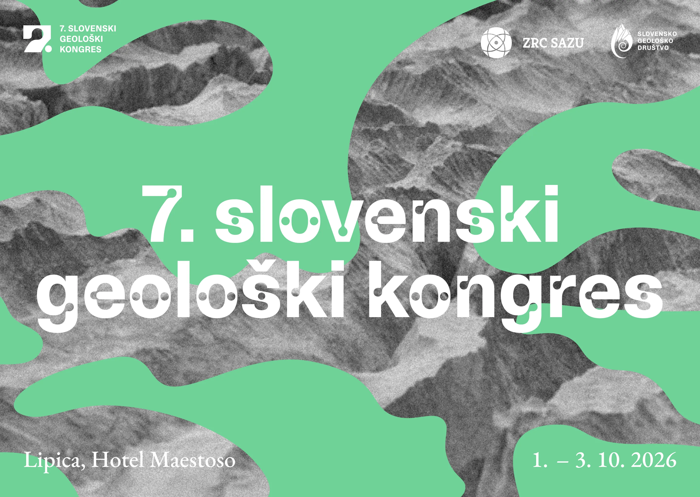
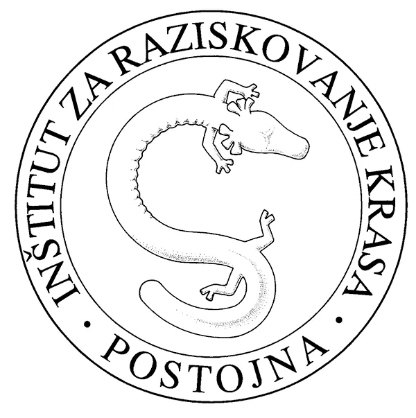
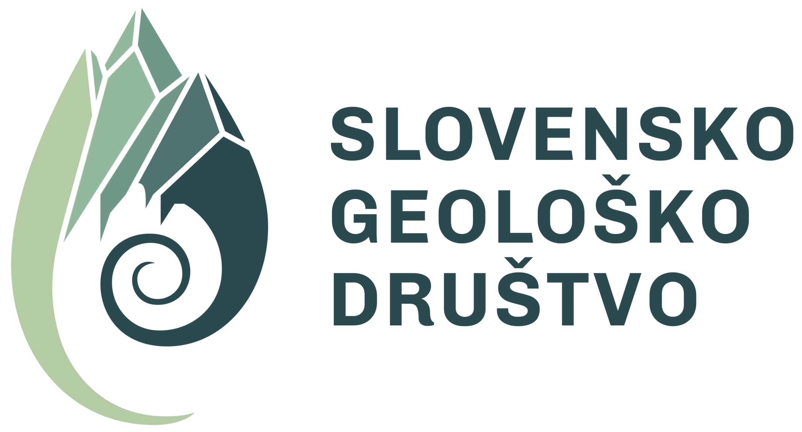

  

  # 7. Slovenski geoloski kongres - spletna stran

  
<strong>Uradna predstavitvena stran za 7. Slovenski geoloski kongres (SGK)</strong>

  
<em>Lipica, Hotel Maestoso · 1.-3. oktober 2026</em>

---

## O projektu
Ta repozitorij vsebuje statično spletno stran za slovenski geoloski kongres:
- vstopna stran (`index.html`)
- kronica / obvestilo (`circular.html`)
- skupni slog (`styles.css`)
- slike, logotipi in vizualni materiali kongresa

Spletisce je namenjeno objavi osnovnih informacij o dogodku, prijavah, datumih, programu in organizaciji kongresa.

## Organizatorji
<table style="border-collapse: collapse; width: 100%;">
  <tr>
    <td align="center" width="50%" style="background: #ffffff; padding: 16px; border: 1px solid #dfe6ea;">
      
      
    </td>
    <td align="center" width="50%" style="background: #ffffff; padding: 16px; border: 1px solid #dfe6ea;">
      
    </td>
  </tr>
</table>

## Vizualni materiali
- naslovna grafika: `complete_header.webp`
- mini glava obvestila: `dopis-header.webp`
- logotip ZRC SAZU: `zrcsazu.png`
- logotip SGD: `sgd.png`
